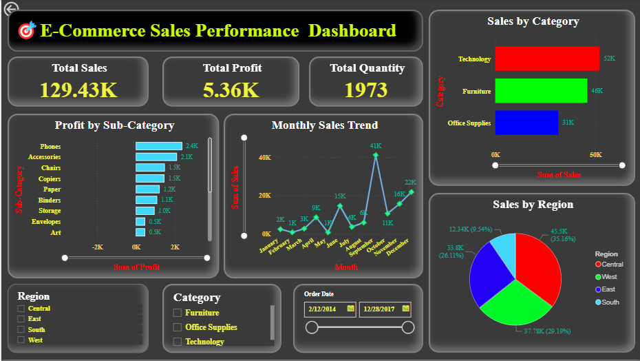

# FUTURE_DS_01
📊 Business Sales Dashboard From E-commerece Data (Task 1)

This is an interactive Power BI dashboard project created as part of the **Future Interns – Data Science & Analytics Internship Program.

---

## 🧾 Overview

This dashboard analyzes E-commerce Sales Records, focusing on:

- 📈 Total Sales, Profit, and Quantity
- 🏷️ Sales by Category and Sub-Category
- 🌍 Sales by Region
- 🗓️ Monthly Sales Trend
- 🎯 ROI and Profitability insights

---

## 📌 Key Features

- **KPI Cards** for Total Sales, Profit, Quantity, Discount, etc.
- **Bar Charts** for Sales by Category and Profit by Sub-Category
- **Line Chart** for Monthly Sales Trend
- **Pie Chart** for Regional Sales
- **Slicers** for Region, Category & Date Filtering

---

## 📷 Dashboard Preview

.png)
.png)
.png)
.png)

---

## 📁 Files in This Repo

- `Ecommerce_Sales_Dashboard_Task1.pbix` → Power BI dashboard file
- `Ecommerce_Sales_Data.csv` → Source data (500 rows used)
- `/Dashboard_Images` → Dashboard screenshots
- `README.md` → This file

---

## 🔗 Live Links

- 🔗 [LinkedIn Project Post]([paste-your-linkedin-post-link-here](https://www.linkedin.com/posts/deepraj-bhadauria-471453315_powerbi-dataanalytics-dashboarddesign-activity-7358963283959115777-A4MW?utm_source=share&utm_medium=member_desktop&rcm=ACoAAE_6a9UBMGzKg5K_K3GpqPfsQzxOUJAAcZU))
- 🔗 [Power BI Report GitHub Link](https://github.com/deeprajbhadauria95/FUTURE_DS_01)

---

## 👨‍💻 Created By

Deepraj Bhadauria  
📍Amity University Gwalior, Madhya Pradesh  
🎓 MCA'2026  
[🔗 LinkedIn](www.linkedin.com/in/deepraj-bhadauria-471453315)
